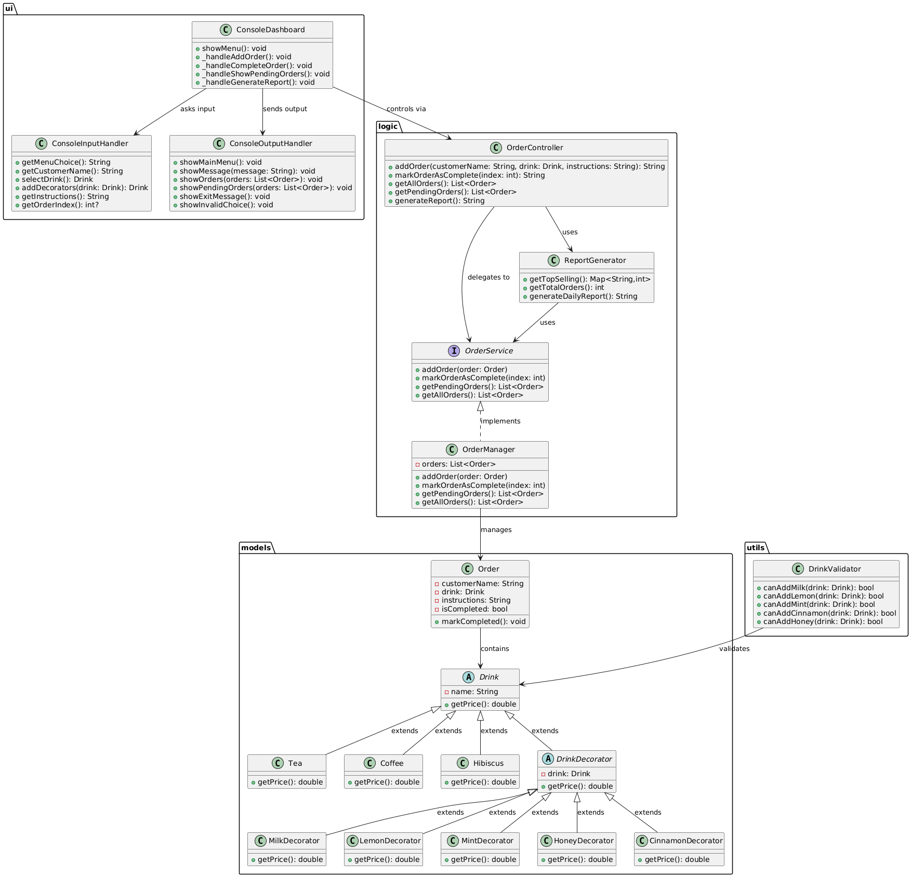
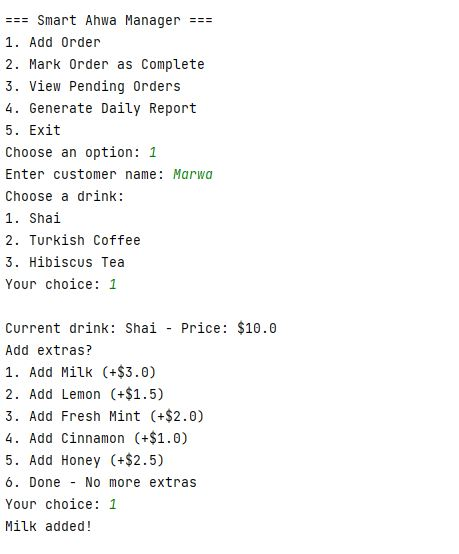
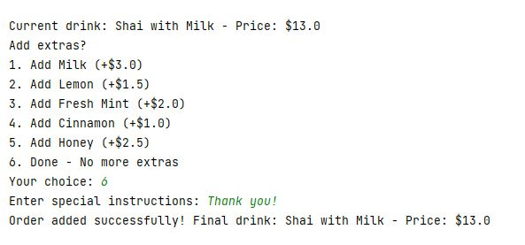
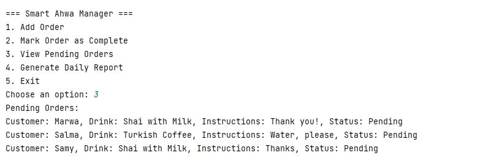
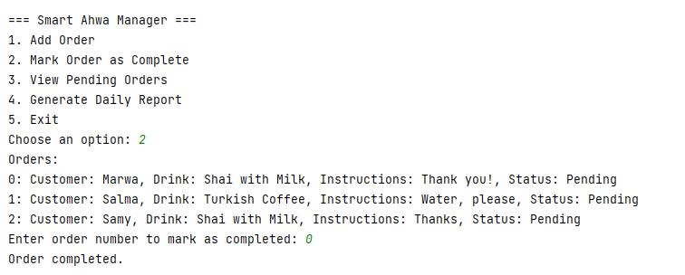
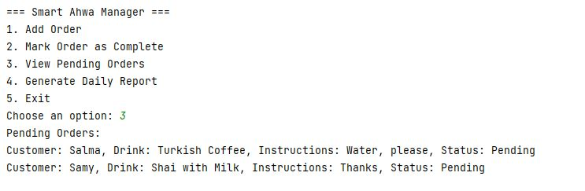
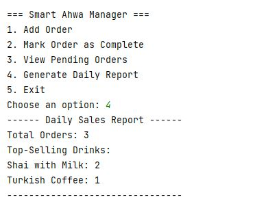

# Smart Ahwa Manager (Dart Console App)

A console-based management system for a traditional Cairo ahwa (coffee shop), built entirely in Dart.  
This app helps ahwa owners streamline operations: efficiently manage customer orders, track popular drinks, and generate daily sales reports to optimize business performance.

---

## 🎯 Project Goal 

As a professional ahwa owner, managing orders manually can be error-prone and time-consuming.  
This app allows you to:

- Add customer orders with the drink type and special instructions.
- Mark orders as completed.
- View pending orders in a dashboard.
- Generate daily sales reports including top-selling drinks and total orders served.

This solves the problem of inefficient manual order tracking and provides insight into sales trends.

---

## ✨ Features

- Add new customer orders (name, drink type, flavours, special instructions).  
- Mark orders as completed.  
- View a dashboard of pending orders.  
- Generate daily sales reports:
  - Total number of orders served.
  - Top-selling drinks.

---

## 🗂️ Architecture 

The project is structured in **three layers** to separate responsibilities and make the system modular:

### 1. UI Layer (Console)
- **ConsoleDashboard** → Main menu, coordinates user input/output.  
- **ConsoleInputHandler** → Handles input from the user.  
- **ConsoleOutputHandler** → Handles displaying information and messages.

### 2. Business Logic Layer
- **OrderController** → Coordinate order operations.  
- **OrderManager** → Implements `OrderService` to manage orders (add, complete, query).  
- **ReportGenerator** → Uses `OrderService` to compute sales statistics and generate reports.

### 3. Data Layer (In-memory)
- **Order** → Represents a customer order (customer name, drink type, flavours, instructions, status).  
- **Drink (abstract)** → Base class for drinks (`Tea`, `Coffee`, `Hibiscus`).  
- **DrinkDecorator** → Base class for extras; concrete decorators (`MilkDecorator`, `LemonDecorator`, `HoneyDecorator`, `CinnamonDecorator`, `MintDecorator`) allow dynamic modification of drinks.

## 🏗️ UML Class Diagram


## 🌐 Class Relationships
- `Order` contains a `Drink` (composition).  
- `OrderManager` manages multiple `Order` instances.  
- `OrderController` **delegates** order-related operations to `OrderService` (`OrderManager`).  
- `ReportGenerator` **uses** `OrderService` to generate reports.  
- `Dashboard` depends on `OrderManager` and `ReportGenerator` to show orders and reports.  
- `DrinkDecorator` wraps a `Drink` (Decorator Pattern).  
- Concrete decorators (`CinnamonDecorator`, `HoneyDecorator`, `MilkDecorator`, `LemonDecorator`, `MintDecorator`) extend `DrinkDecorator`.  
- Concrete drinks (`Tea`, `Coffee`, `Hibiscus`) extend `Drink`.

---
## 🖼️ Screenshots

### 📱 Order Management
 


### 📋 Order Tracking  
 



### 📊 Sales Reports


---

## 🔑 OOP Concepts Applied

- **Encapsulation** → Private fields like `Order._isCompleted` and `OrderManager._orders` are accessed and modified only through public methods, ensuring controlled access.
- **Inheritance** → `Tea`, `Coffee`, `Hibiscus` extend `Drink`. Concrete Decorators extend `DrinkDecorator`.  
- **Polymorphism** → `Drink` subclasses (`Tea`, `Coffee`, `Hibiscus`) and decorators (`CinnamonDecorator`, `HoneyDecorator`, etc.) override `getPrice()` differently. 
- **Abstraction** → `Drink` defines a common interface for all drinks; `OrderService` defines a contract for order operations that can have multiple implementations.

---

## 📐 SOLID Principles Applied

- **Single Responsibility Principle (SRP)** → Each class has a single responsibility (e.g., `OrderManager` only manages orders, `ReportGenerator` only generates reports).  
- **Open/Closed Principle (OCP)** → Adding new drinks or extras does not modify existing classes, only requires new subclasses/decorators.  
- **Dependency Inversion Principle (DIP)** → `OrderController` and `ReportGenerator` depend on abstractions (`OrderService`) rather than concrete classes.

---

## 🛠️ Design Patterns Applied

- **Decorator Pattern** → Allows dynamically adding extras to drinks without modifying base classes.

---

## 🖥️ How to Run

1. **Install Dart SDK** (https://dart.dev/get-dart).  
2. Clone the repository:

```bash
git clone https://github.com/androiddevii/AhwaManager.git
